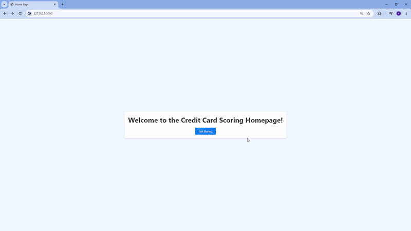

# End-to-end Credit Card Score Machine Learning Project

## Objective
In this project, I explored and implemented a pipeline for credit score web app that consists of several stages:

- Exploring the dataset to identify relationships between features.
- Conducting feature engineering.
- Experimenting with various machine learning models to identify the best-performing model.
- Creating an end-to-end machine learning project.
- Deploying the application using Flask and containerizing it with Docker.

## Dataset
The dataset utilized in this repository was downloaded from: https://www.kaggle.com/datasets/parisrohan/credit-score-classification

A credit score is a numerical value ranging from 300 to 850 (categorized in this dataset as poor, standard, and good) that indicates a consumer's creditworthiness. Higher scores signify better creditworthiness to potential lenders.

## Pipeline
Lorem ipsum.

## Deployment Overview
Below is an example of the deployed web application. Users can input their credit card information, and the machine learning model will predict the credit score category (poor, standard, or good).

